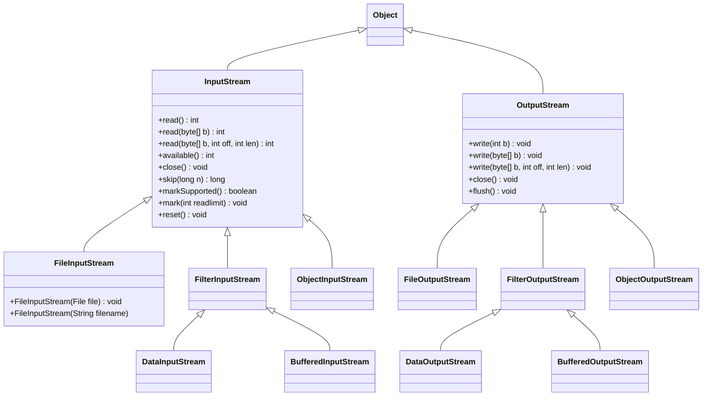

# 一、基本概念

## (一) 文本文件与二进制文件区别

1、文本文件可以使用文本编辑器进行处理（读取、创建、修改）。

2、二进制文件是所有非文本文件，不能使用文本编辑器进行处理。

3、文本文件是由“字符”序列构成，二进制文件是由位（bit）序列构成。

4、二进制文件处理效率高于文本文件。

## (二) Java如何处理文本I/O

1、使用Scanner类读取文本数据。

2、使用PrintWriter类写文本数据。

## (三) 文本I/O与二进制I/O

1、二进制I/O不涉及编码与解码，因此比文本I/O效率更高。

2、读写二进制文件的根类：

(1) InputStream

(2) OutputStream

3、辨别字节流与字符流类

(1) 带有Writer 或 Reader的类为字符流。

(2) 带有Input，Output 的类为字节流类。

## (四) I/O 的概念

1、I/O 即 输入Input/ 输出Output的缩写，是计算机调度把各个存储中的数据写入写出的过程；

2、java用 “ 流 （Stream）” 来抽象表示这个写入写出的功能，并封装成一个“ 类 ” ，放在 java.io包内。

## (五) “ 流 ” 是什么

​	通过“ 流 ” 的形式允许java程序使用相同的方式来访问不同的输入、输出源。stream是从起源（source）到接收（sink）的有序数据。我们这里把输入/输出源对比成“ 水桶 ”，那么流就是“ 管道 ”，管道的粗细、单向性等属性也就区分了不同“ 流 ” 的特性。

Source---->----i n f o r m a t i o n---->-----(reads)-->Program

​                        (   S t r e a m   )

## (六) IO流的分类

​	可从三个不同维度进行分类：

### 1、按照流的方向（站在程序所在内存的角度）

(1) 输入流：从中读取数据（InputStream和Reader为基类）

(2) 输出流：向其写入数据（outputStream和Writer为基类）

### 2、按照流的操作颗粒度划分

(1) 字节流：以字节为单元，可操作任何数据（InputStream和outputStream为基类）

(2) 字符流：以字符为单元，只能操作纯字符数据，较方便（Reader和Writer为基类）

### 3、按照流的角色划分

(1)节点流：可以从/向一个特定IO设备（如磁盘、网络）读/写数据的流，也叫【低级流】。

(2)处理流：用于对一个已存在的流进行连接和封装，通过封装后的流来实现数据的读/写功能，也叫【高级流】
