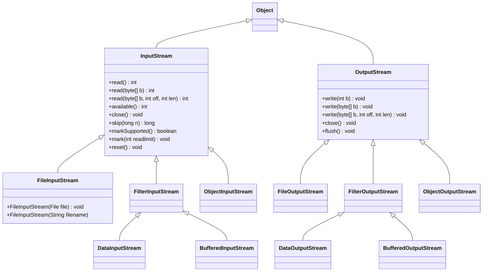

# 一、基本概念

## （一）文本文件与二进制文件区别

​	1、文本文件可以使用文本编辑器进行处理（读取、创建、修改）。

​	2、二进制文件是所有非文本文件，不能使用文本编辑器进行处理。

​	3、文本文件是由“字符”序列构成，二进制文件是由位（bit）序列构成。

​	4、二进制文件处理效率高于文本文件。

## （二）Java如何处理文本I/O

​	1、使用Scanner类读取文本数据。

​	2、使用PrintWriter类写文本数据。

## （三）文本I/O与二进制I/O

​	1、二进制I/O不涉及编码与解码，因此比文本I/O效率更高。

​	2、读写二进制文件的根类：

​		（1）InputStream

​		（2）OutputStream

